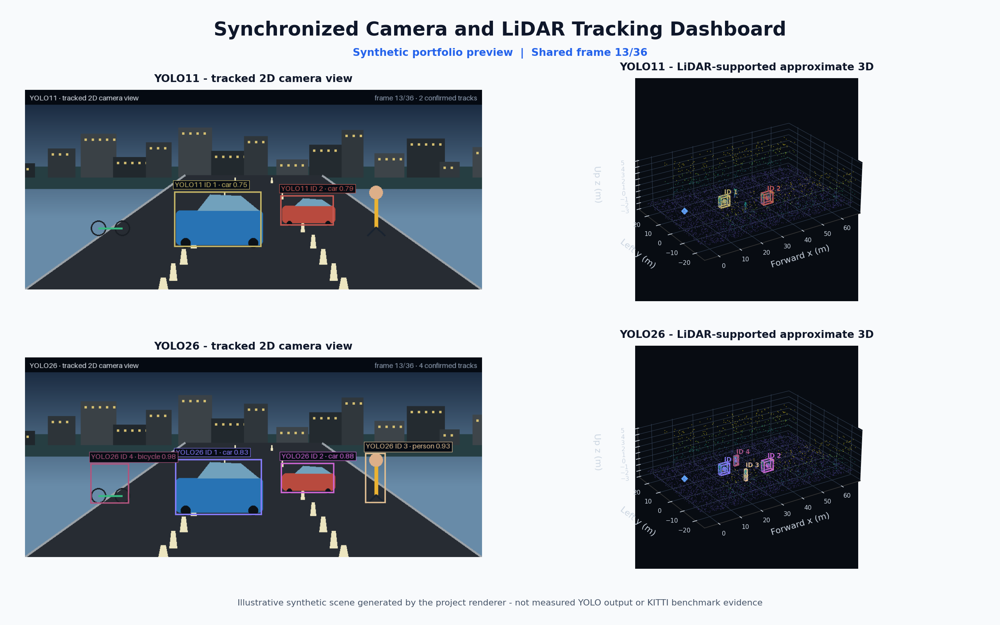
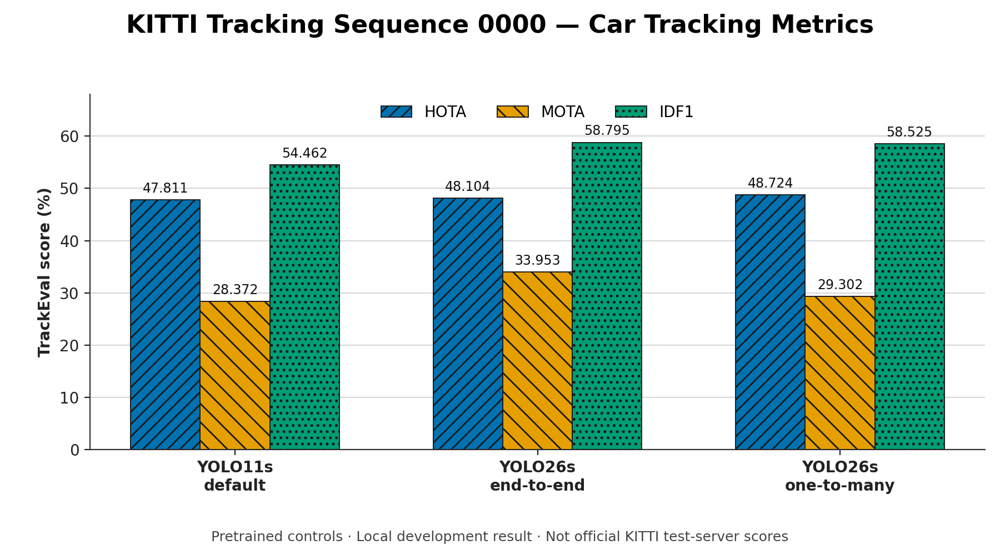

# Camera/LiDAR Detection and Tracking Prototype

[](https://github.com/ms0525/camera-lidar-3d-tracking/actions/workflows/public-preview.yml)
[](LICENSE)

A multimodal perception prototype that compares YOLO11s and YOLO26s camera
detections, assigns class-aware Deep SORT track IDs, and associates calibrated
LiDAR returns with each 2D box to estimate an approximate 3D location.

> [!IMPORTANT]
> This is not a learned 3D detector. Box dimensions are class priors, yaw is
> not estimated, and all reported tracking results use pretrained COCO
> checkpoints. Full KITTI detector fine-tuning has **not** been completed.

## What the project does

- Loads synchronized KITTI camera, calibration, label, and Velodyne data.
- Runs YOLO11s or YOLO26s 2D object detection.
- Tracks detections over time with exact-class Deep SORT association.
- Projects LiDAR points into the camera using KITTI calibration.
- Uses depth clustering inside each 2D box to estimate a LiDAR-supported center.
- Displays synchronized 2D camera and approximate 3D LiDAR views.
- Exports KITTI Tracking predictions and evaluates HOTA, MOTA, IDF1, and IDSW
  with TrackEval.

```text
camera image -> YOLO 2D boxes -> class-aware Deep SORT IDs
                         |
calibration + LiDAR -----+-> point projection + depth clustering
                                  |
                                  +-> approximate 3D boxes
```

Projection uses the complete KITTI transform:

```text
pixel ~ P2 @ R0_rect @ Tr_velo_to_cam @ point_velodyne
```

## Dashboard



The Streamlit dashboard keeps one synchronized frame index across four panels:

1. YOLO11 · Camera 2D
2. YOLO11 · LiDAR 3D
3. YOLO26 · Camera 2D
4. YOLO26 · LiDAR 3D

Arrow keys, frame seeking, autoplay, ground-truth overlays, and labeled 3D
boxes are supported. The hosted portfolio mode generates deterministic
synthetic data; it does not download KITTI, load model weights, or access a
visitor's computer. Real inference is available only in the local live mode.

## Results



### Initial pretrained control

Local KITTI Tracking sequence `0000`, Car class, confidence `0.28`, image size
`640`:

| Pretrained control | HOTA (%) | MOTA (%) | IDF1 (%) | Runtime (s) |
|---|---:|---:|---:|---:|
| YOLO11s | 47.811 | 28.372 | 54.462 | 44.49 |
| YOLO26s end-to-end | 48.104 | 33.953 | 58.795 | 41.36 |
| YOLO26s one-to-many | 48.724 | 29.302 | 58.525 | 44.94 |

This single-sequence screen predates the exact-class association correction.
It is useful as a controlled model comparison, not as a general detector
ranking.

### Corrected fixed-split tracking

The current protocol uses YOLO26s end-to-end predictions, exact-class
association, and frozen Car/Person confidence thresholds of `0.28`.

| Development split | Class | HOTA (%) | MOTA (%) | IDF1 (%) | IDSW |
|---|---|---:|---:|---:|---:|
| Tune: 12 sequences / 5,027 frames | Car | 49.539 | 56.788 | 62.410 | 285 |
| Tune: 12 sequences / 5,027 frames | Pedestrian | 38.507 | 41.026 | 55.505 | 106 |
| Validation: 9 sequences / 2,981 frames | Car | 55.708 | 63.479 | 69.791 | 123 |
| Validation: 9 sequences / 2,981 frames | Pedestrian | 43.126 | 40.826 | 59.921 | 41 |

**Evaluation status:** these are local TrackEval development measurements using
pretrained COCO checkpoints. They are not official KITTI test-server scores.
The validation sequences are disjoint from tuning, but the split is not
pristine because sequence `0014` was inspected during earlier smoke work.

Full DetA, AssA, FP, FN, protocol settings, and caveats are stored in the
[machine-readable metrics summary](docs/results/tracking_metrics_summary.json).
See the [experiment guide](docs/EXPERIMENTS.md) for reproduction details.

## Training status

### KITTI fine-tuning pipeline: prepared, not completed

The repository includes dataset validation, YOLO11s/YOLO26s training launchers,
experiment manifests, and safe resume checks. A tiny one-epoch YOLO26s run on a
32-training/8-validation-image subset verified that the Windows AMD ROCm
toolchain executes correctly.

That smoke run is not an accuracy experiment. The full controlled YOLO11s vs
YOLO26s KITTI fine-tuning comparison remains future work, and none of the
tracking scores above came from a fine-tuned checkpoint.

## Quick start

### Lightweight portfolio preview

The preview requires no dataset, model weights, GPU, or Ultralytics install.

```powershell
git clone https://github.com/ms0525/camera-lidar-3d-tracking.git
cd camera-lidar-3d-tracking

python -m venv .venv
.\.venv\Scripts\Activate.ps1
python -m pip install --upgrade pip
python -m pip install -r app\requirements.txt
python -m streamlit run app\streamlit_app.py
```

Open `http://localhost:8501`. Leave `DASHBOARD_ENABLE_LIVE` and
`DASHBOARD_TRUSTED_LOCAL` unset for preview mode.

### Local KITTI + model inference on Windows AMD ROCm

Install the appropriate ROCm PyTorch build first, then install both dependency
sets:

```powershell
python -m pip install -r requirements.txt -r app\requirements.txt

.\scripts\run_streamlit_rocm.ps1 `
  -DatasetRoot "C:\path\to\KITTI\tracking" `
  -Yolo11Model "C:\path\to\yolo11s.pt" `
  -Yolo26Model "C:\path\to\yolo26s.pt" `
  -Sequence 0000
```

The launcher validates the dataset, weights, Python environment, Streamlit,
ROCm device, and compiler headers before binding the app to `127.0.0.1`.
Pass `-PythonPath` if the ROCm environment is not the repository `.venv`.

See the complete [deployment guide](app/DEPLOYMENT.md) for AMD setup, hosting
limits, and environment variables.

## Local data and models

KITTI data and YOLO weights are intentionally excluded from this repository.
Supply a KITTI Tracking root with this structure:

```text
KITTI_TRACKING_ROOT/
  training/
    image_02/0000/*.png
    velodyne/0000/*.bin
    calib/0000.txt
    label_02/0000.txt       # optional for visualization; required for evaluation
```

The dataset root may point to the directory containing `training` or directly
to the `training` directory. Camera frames and Velodyne scans must share the
same numeric frame IDs.

Compatible model paths are supplied explicitly. The documented comparison uses
YOLO11s and YOLO26s checkpoints, while the runners retain earlier YOLOv8
compatibility.

### Core command-line viewers

```powershell
# Interactive or headless 2D tracking
python track_sequence.py `
  --dataset-root "C:\path\to\KITTI\tracking" `
  --sequence 0000 `
  --model "C:\path\to\yolo26s.pt" `
  --imgsz 640

# LiDAR-supported 3D tracking
python track_3d_visualization.py `
  --dataset-root "C:\path\to\KITTI\tracking" `
  --sequence 0000 `
  --model "C:\path\to\yolo26s.pt" `
  --imgsz 640
```

Use `--show-ground-truth` with labeled training sequences. Use `--headless` for
batch processing and export.

## Evaluation

The project can:

- export complete sequence predictions in official KITTI Tracking text format;
- run fixed tune/validation sequence presets;
- evaluate Car and Pedestrian with the official TrackEval KITTI 2D adapter; and
- screen class-confidence candidates without reading the held-out split.

Commands, the pinned TrackEval revision, split definitions, metric meanings,
and reporting rules are documented in
[`docs/EXPERIMENTS.md`](docs/EXPERIMENTS.md).

## Project structure

```text
app/
  streamlit_app.py              Four-panel dashboard
  dashboard_core.py             Synthetic preview and renderers
  live_runtime.py               Opt-in local KITTI/model adapter
config/
  kitti_tracking_splits.json    Reproducible development splits
docs/
  EXPERIMENTS.md                Export, evaluation, and training protocol
  PUBLIC_RELEASE.md             Publication safety checklist
  results/                      Sanitized aggregate metrics
scripts/
  audit_public_release.py       Dataset/model/secret release guard
  run_streamlit_rocm.ps1        Local AMD dashboard launcher
  train_kitti_rocm.ps1          Local AMD training launcher
utils/                          Calibration, geometry, KITTI, and TrackEval helpers
track_sequence.py               2D tracking and KITTI export
track_3d_visualization.py       LiDAR-supported 3D viewer
train_kitti_detector.py         Reproducible detector training entry point
evaluate_kitti_tracking.py      TrackEval entry point
tests/                          Synthetic unit and integration fixtures
```

## Tests

Preview tests require only `app/requirements.txt`:

```powershell
python -m unittest discover -s tests -p "test_dashboard_core.py" -v
python -m unittest discover -s tests -p "test_streamlit_dashboard.py" -v
```

After installing both dependency sets and the intended PyTorch backend, run the
complete suite and public-release audit:

```powershell
python -m unittest discover -s tests -v
python scripts\audit_public_release.py
```

Tests create temporary synthetic camera, calibration, label, and point-cloud
fixtures; a KITTI download is not required for the test suite.

## Current limitations

- The detector is 2D; LiDAR provides approximate localization rather than a
  learned 3D box prediction.
- Predicted dimensions use class priors and predicted yaw is fixed at zero.
- Deep SORT tracks 2D appearance and motion, not a 3D state.
- Overlapping image boxes can associate with the wrong LiDAR surface.
- Ego-motion compensation is not implemented.
- Pedestrian tracking remains substantially weaker than Car tracking.
- Full detector fine-tuning and quantitative 3D IoU evaluation remain pending.

## Licence and data terms

Project source is licensed under
[GNU AGPL version 3 only](LICENSE). Ultralytics publishes YOLO code and models
under AGPL-3.0 and offers separate Enterprise terms for proprietary use; review
the [official Ultralytics licensing page](https://www.ultralytics.com/license)
for your use case. No model weights are distributed here.

KITTI data is not distributed. Download it from the
[official KITTI website](https://www.cvlibs.net/datasets/kitti/) and follow its
CC BY-NC-SA 3.0 attribution, non-commercial, and share-alike terms. See
[NOTICE](NOTICE) for third-party acknowledgements.

## Additional documentation

- [Experiment and evaluation guide](docs/EXPERIMENTS.md)
- [Dashboard deployment](app/DEPLOYMENT.md)
- [Public-release checklist](docs/PUBLIC_RELEASE.md)
- [Security policy](SECURITY.md)
